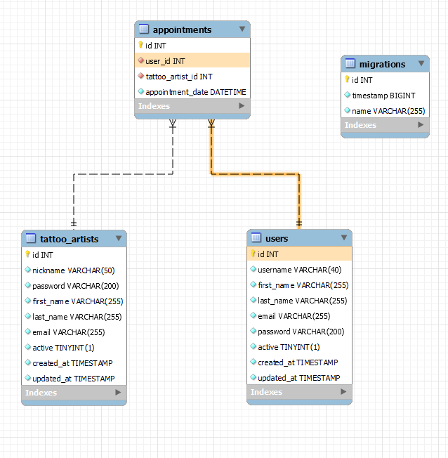

# Welcome to my backend app

## king_tattoo


<details>
  <summary>Contenido 📝</summary>
  <ol>
    <li><a href="#objetivo">Objetivo</a></li>
    <li><a href="#sobre-el-proyecto">Sobre el proyecto</a></li>
    <li><a href="#stack">Stack</a></li>
    <li><a href="#diagrama-bd">Diagrama</a></li>
    <li><a href="#instalación-en-local">Instalación</a></li>
    <li><a href="#endpoints">Endpoints</a></li>
    <li><a href="#futuras-funcionalidades">Futuras funcionalidades</a></li>
    <li><a href="#contribuciones">Contribuciones</a></li>
    <li><a href="#licencia">Licencia</a></li>
    <li><a href="#webgrafia">Webgrafia</a></li>
    <li><a href="#desarrollo">Desarrollo</a></li>
    <li><a href="#agradecimientos">Agradecimientos</a></li>
    <li><a href="#contacto">Contacto</a></li>
  </ol>
</details>

## Objetivo
Este proyecto requería una API funcional conectada a una base de datos 

## Sobre el proyecto
Decidí crear una aplicación web para ayudar a los amantes del tatuaje, que les permitiría crear y realizar un seguimiento de sus citas asi como solicitar alguna nueva. 


## Stack
Tecnologías utilizadas:
<div align="center">
<a href="https://www.mysql.com/">
    
</a>
<a href="https://www.expressjs.com/">
    
</a>
<a href="https://nodejs.org/es/">
    
</a>
<a href="https://developer.mozilla.org/es/docs/Web/JavaScript">
    
</a>
 </div>


## Diagrama BD


## Instalación en local
1. Clonar el repositorio
2. ` $ npm install `
3. Conectamos nuestro repositorio con la base de datos 
4. ``` $ Ejecutamos las migraciones ``` 
5. ``` $ npm run dev ``` 


## Endpoints
<details>
<summary>Endpoints</summary>

http://localhost:3000

    - REGISTER USER

            POST /api/authUser/register
        body:
        ``` js
           {
            "username" : "usuario.prueba.register",
            "first_name": "prueba",
            "last_name": "prueba",
            "password": "123456",
            "phone": "789456123",
            "email" : "usuario.prueba.register@example.com"
           }
        ```

    - LOGIN

            POST /api/authUser/login  
        body:
        ``` js
            {
                
                 "email": "usuario.prueba.register@example.com",
                 "password":"123456"

            }
        ```
    - USER PROFILE 

            GET /api/users/1   MIDDLEWARE (auth) 
       
    - UPDATE PROFILE 

            PATCH /api/users/1    MIDDLEWARE (auth)
        body:
        ``` js
             {
                "username" : "cambionuevoreynaldo52.munoz",
                "first_name": "cambioreynaldo",
                "last_name": "munoz",
                "email" : "cambionuevoreynaldo52@example.com",
                "password": "123456"
            }
        ```
    - REGISTER ARTIST

            POST /api/authArtist/register
        body:
        ``` js
           {
                "nickname" : "aaaaaUsiarioPriebaCita",
                "first_name": "UsiarioPriebaCi",
                "last_name": "FuCita",
                "password": "123456",
                "email" : "caaaaaita@example.com",
                "role" : "admin"    
           }
        ```

    - LOGIN

            POST /api/authArtist/login  
        body:
        ``` js
            {
                
                 "password": "123456",
                "email" : "caaaaaita@example.com"

            }
        ```
    - ARTIST PROFILE 

            GET /api/authArtist/1   MIDDLEWARE (authArtist , isAdmin) 
       
    - UPDATE  ARTIST PROFILE 

            PATCH /api/authArtist/1   MIDDLEWARE (authArtist , isAdmin) 
        body:
        ``` js
             {
                "nickname" : "UsiarioPriebaCita",
                "first_name": "PRUEBAUsiarioPriebaCi",
                "last_name": "PRUEBAFuCita",
            }
        ```

        
    - APPOINTMENT CREATION

            POST /api/appointments/ 
        body:
        ``` js
            {
                
                  "user_id": 1,
                  "tattoo_artist_id": 1,
                  "appointment_date": "2024-04-17 10:30:00"

            }
        ```
        
    - APPOINTMENT UPDATE

            PATCH /api/appointments/1
        body:
        ``` js
            {
                
                  "user_id": 1,
                  "tattoo_artist_id": 2,
                  "appointment_date": "2024-04-21 10:30:00"

            }
        ```
     - APPOINTMENT DELETE

            DELETE /api/appointments/1

     - USER APPOINTMENT

            GET /api/users/1/appointments

     - TATTOO_ARTIST APPOINTMENT

            GET /api/artist/1/appointments  MIDDLEWARE (authArtist)
 


    - ...
</details>

## Futuras funcionalidades
[ ] Añadir admin, superadmin 
[ ] Vizualizar Diseño de tattoo
 

## Contribuciones
Las sugerencias y aportaciones son siempre bienvenidas.  

Puedes hacerlo de dos maneras:

1. Abriendo una issue
2. Crea un fork del repositorio
    - Crea una nueva rama  
        ```
        $ git checkout -b feature/nombreUsuario-mejora
        ```
    - Haz un commit con tus cambios 
        ```
        $ git commit -m 'feat: mejora X cosa'
        ```
    - Haz push a la rama 
        ```
        $ git push origin feature/nombreUsuario-mejora
        ```
    - Abre una solicitud de Pull Request

## Licencia
Este proyecto se encuentra bajo licencia de "ReynaldoM"

## Webgrafia:
Para conseguir mi objetivo he recopilado información de:
- https://www.npmjs.com/package//typeorm


## Agradecimientos:

Agradezco a mis compañeros el tiempo dedicado a este proyecto:

- *Erika*  
<a href="https://github.com/AkireOrl/" target="_blank"></a> 

- **Gabriel**  
<a href="https://github.com/GabrielEscudillo" target="_blank"></a>

- ***Rodrigo***  
<a href="https://github.com/el-ro" target="_blank"></a> 

## Contacto
<a href = "mailto:reynaldo.munozf21@gmail.com"></a>
<a href="www.linkedin.com/in/reynaldo-muñoz-flores" target="_blank"></a> 
</p>
